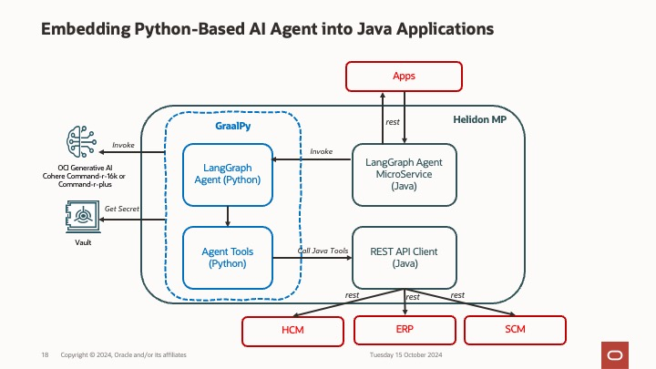

# Embedding Python-based AI Agents into Java Applications

## Introduction

While Python is commonly used in AI development, we understand that Java may be the preferred programming language and standard in certain organizations. When developing REST services that incorporate AI with Agent capabilities, finding a suitable Java-based agent framework for integrating Large Language Models (LLMs) or AI Agent solutions can be challenging.

This sample demonstrates how to use LangGraph and GraalPy to create an agent-based microservice with Helidon MP, enabling seamless integration with Oracle Cloud Infrastructure Generative AI services.

## Design



## LangGraph

[LangGraph](https://langchain-ai.github.io/langgraph/) is a powerful framework for building stateful, multi-actor applications utilizing Large Language Models (LLMs). It facilitates the creation of sophisticated agent and multi-agent workflows.

## GraalPy

[GraalPy](https://www.graalvm.org/python/)is a high-performance Python implementation running on the GraalVM platform. By leveraging GraalVM’s advanced capabilities, GraalPy enhances Python's performance. GraalVM is a versatile virtual machine that supports multiple programming languages, providing improved performance, interoperability, and scalability.

Key Features of GraalPy:
- High Performance: GraalPy optimizes Python code by leveraging GraalVM's Just-In-Time (JIT) compiler, resulting in improved execution speed, particularly in performance-sensitive applications.
- Polyglot Interoperability: GraalPy’s polyglot capabilities enable seamless interaction between various languages such as Java, JavaScript, Ruby, and R, allowing code from different languages to interact without significant overhead.
- Native Interfacing: GraalPy supports interaction with native libraries, allowing Python programs to execute native code. This feature is especially useful for applications requiring system-level optimizations.

## Prerequisite

- OCI CLI was installed and configured on a local machine.
- Clone this repository
- Install JDK 21 on a local machine. (Note: This is the minimum requirement for Helidon 4.x, see [Helidon v4 documentation](https://helidon.io/docs/v4/mp/guides/config) for details)
Follwo the OCI environment configuration instruction in [Oracle Cloud Infrastructure SDK for Java Configuration](https://docs.oracle.com/en-us/iaas/Content/API/Concepts/sdkconfig.htm#:~:text=Oracle%20Cloud%20Infrastructure%20SDK%20for%20Java%20Configuration) to setup the config file.

## Oracle Cloud Infrastructure Service

This demonstration requires the following Oracle Cloud Infrastructure Service:

- [Oracle Cloud Infrastructure Generative AI Service](https://www.oracle.com/au/artificial-intelligence/generative-ai/)

## Configuration and Installation

### Create secret in OCI Vault

Create a vault, master key, and secret for the HCM user to access the HCM API. For detailed instructions, refer to [Creating a Secret in a Vault](https://docs.oracle.com/en-us/iaas/Content/KeyManagement/Tasks/managingsecrets_topic-To_create_a_new_secret.htm). After creating the secret, make sure to copy the vault OCID, compartment OCID, and secret OCID, and include them in the application configuration file in the following configuration step.

### Configuration

Modify the application.yaml file in src/main/resources/application.yaml for your enviornment:  
- Use the OCI Vault environment details created in previous step and update the vault-ocid, compartment-ocid and secret-ocid.  The OCI config-profile is the profile name in "$HOME/.oci/config", the default is "DEFAULT".
- Update the HCM host and HCM username for the HCM API call.
- Update the following OCI GenAI environment details:
    - model_id : You need to use the Chat model for tool call. For example : cohere.command-r-plus
    - service_endpoint : For OCI GenAI interence service endpoint, refer to [Generative AI Service Inference API](https://docs.oracle.com/en-us/iaas/api/#/en/generative-ai-inference/20231130/)
    - comparment_id :  Comparmnent OCID of the GenAI Service.
- The following model parameters are for testing only.  Currently, only the following parameters are used in this sample application. Adjuest the parameters if required.
    - temperature
    - max_tokens
    - seed 

### Build and Package
To build and package the project:

```bash
mvn clean   #if required, run more than one time to ensure the target folder is deleted.
mvn package

```

## Test and Run

Run the Helidon MP server with the following command:

```bash
java -jar target/langgraph.jar
```

To test the service, use this curl command:

```bash
curl -X POST http://localhost:8080/langgraph/invoke -d'{"question":"Using the Employee API, tell me something about an employee named Casey Brown. Then use the Absences API to find his Absences and see if any approval needed"}' -H "Content-Type: application/json"
```

## Run in Debug mode

To run the application in debug mode, add the following in the Java VM argugment :

-Dpolyglot.log.file=./polyglot.log -Dpolyglot.inspect.Path='langgraph' -Dpolyglot.inspect.Suspend='false'

The above parameters will allow the ployglot to output the log to a log file. To run the application, in your IDE, run Main.java in debug mode. When started, you can open the python debugger in Chrome : devtools://devtools/bundled/js_app.html?ws=127.0.0.1:9229/langgraph. In Chrome, you can set the breakpoint and monitor the variable if needed.

## Contributing

This project welcomes contributions from the community. Before submitting a pull request, please review our [contribution guide](CONTRIBUTING.md)

## Distribution

Developers choosing to distribute a binary implementation of this project are responsible for obtaining and providing all required licenses and copyright notices for the third-party code used in order to ensure compliance with their respective open source licenses.

## Security

Please consult the [security guide ](SECURITY.md)for our responsible security vulnerability disclosure process.

## Help

Visit Oracle Cloud Customer Connect Community at [Cloud Customer Connect ](https://cloudcustomerconnect.oracle.com/)for additional resources and FAQs.

## License

Copyright (c) 2023, 2024 Oracle and / or its affiliates.
Released under the Universal Permissive License v1.0 as shown at
https://oss.oracle.com/licenses/upl/.
